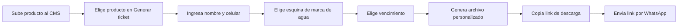
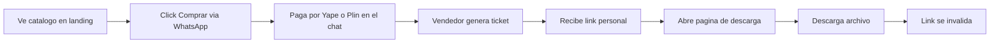

# Handoff: Tienda de productos digitales — Landing + CMS

2026-09-19 · @Someone

## Overview

Esto es el handoff técnico del mockup de diseño (canvas de Artifact) para implementarlo como app real. Es una tienda de productos digitales — PDFs, video-tutoriales, plugins/extensiones (.zip) — vendida por WhatsApp a estudiantes y creadores en Perú, con entrega protegida por watermark personalizado y enlaces de descarga de un solo uso.

El mockup cubre 4 pantallas: la landing pública con catálogo estilo ecommerce, el panel CMS del vendedor (lista de tickets), el formulario de generación de ticket, y la página de descarga que ve el comprador. Este documento traduce esas pantallas a especificación de implementación: tokens, componentes, modelo de datos y flujos, para pegarlo directo en una sesión de Claude Code.

**Marca**: el nombre de la tienda quedó como placeholder `[Nombre de tu tienda]` en el mockup — reemplazar antes de implementar (logo, `<title>`, copy del footer).

## Sistema de diseño

Modo claro. Un solo acento de marca (verde-lima) en dos variantes: brillante para fondos de botón (siempre con texto oscuro encima) y oscura para texto/íconos sobre fondo claro (el lima puro no cumple contraste como texto).

| Token | Valor | Uso |
| --- | --- | --- |
| `color-bg` | `#FAFAF5` | Fondo de página |
| `color-surface` | `#FFFFFF` | Tarjetas, nav, inputs |
| `color-surface-alt` | `#F2F4EA` | Fondo de secciones alternas (catálogo) |
| `color-ink` | `#14150F` | Texto principal, texto sobre botones de acento |
| `color-muted` | `#6E7166` | Texto secundario |
| `color-border` | `#E6E8DD` | Bordes de tarjetas e inputs |
| `color-accent` | `#C8FF3D` | Fondos de botón/CTA, bloques de marca (texto SIEMPRE `color-ink` encima) |
| `color-accent-dark` | `#5B8A00` | Texto, íconos y badges de acento sobre fondo claro |
| `color-accent-tint` | `rgba(91,138,0,0.12–0.14)` | Fondos suaves de ícono/badge |
| `color-warn` | `#A15A00` | Aviso de vencimiento de enlace (semántico, no es el acento de marca) |
| `status-success` | `rgba(91,138,0,0.14)` bg / `#5B8A00` texto | Badge "Descargado" |
| `status-pending` | `#F2F4EA` bg / `#8A8C63` texto | Badge "Pendiente" |
| `status-error` | `#F5E9E5` bg / `#A14B36` texto | Badge "Expirado" |

**Tipografía**: `Space Grotesk` (600/700) para títulos y cifras destacadas; `Manrope` (400–800) para cuerpo y UI. Ambas cargadas vía Google Fonts (`next/font/google` en Next.js).

**Radios**: `999px` (pill) en botones y nav flotante; `16px` tarjetas grandes; `10–12px` inputs, botones secundarios y tarjetas de producto; `8–10px` íconos e íconos-contenedor.

**Espaciado base**: escala de 4px. Paddings de sección: `80px` horizontal desktop / `32px` en breakpoints menores. Gap entre tarjetas: `16–24px`.

**Iconografía**: SVG stroke lineal, `stroke-width` 1.6–2, sin librería externa en el mockup — en la implementación real usar una sola librería de íconos (ver sección de stack).

## Pantallas

### 1. Landing (`/`)

Nav flotante en pill (64px alto, sticky opcional): logo + "\[Nombre de tu tienda\]" + links `#catalogo` / `#como-funciona` + CTA "Ver catálogo".

Hero (grid 12 col, split 6/6): titular ≤ 2 líneas + subtítulo ≤ 20 palabras + un solo CTA ("Ver catálogo") + contador "+120 recursos digitales" (placeholder, reemplazar por conteo real de productos). Visual: 3 tarjetas flotantes rotadas representando categorías (PDF / VIDEO / PLUGIN).

"Cómo funciona": 3 tarjetas iguales, numeradas implícitamente por orden — Escribir por WhatsApp → Pagar por Yape/Plin → Recibir link personal.

"Catálogo" (`#catalogo`, fondo `surface-alt`): grid de 3 columnas, tarjeta por producto = thumbnail con ícono de categoría + badge de categoría + título + precio + botón "Comprar" (deep-link a WhatsApp con el producto precargado en el mensaje). Filtros por categoría (PDF/Video/Plugin) mostrados como pills — en el mockup son estáticos, en la app deben filtrar el grid.

Banner CTA final (fondo `color-accent`) + footer minimal.

### 2. CMS — Panel de tickets (`/admin`, protegido por auth)

Layout de 2 columnas: sidebar fija (232px, nav Tickets/Productos/Analítica) + contenido. Header con título + botón primario "+ Generar ticket". 3 tarjetas de stats (Tickets generados / Descargados / Pendientes). Tabla de tickets: Comprador, Producto, Código, Estado (badge), Fecha — orden descendente por fecha.

### 3. CMS — Generar ticket (`/admin/tickets/nuevo`)

Modal o página centrada (560px). Campos: Producto (select), Nombre del comprador (text), Celular (tel), posición de marca de agua (selector visual de 4 esquinas, un solo valor activo a la vez), vencimiento (select: 24h / 48h / al primer uso). Botón primario "Generar ticket y copiar link" — en la app real dispara la generación server-side (ver Flujos) y copia el link al portapapeles.

### 4. Página de descarga (`/descargar/[codigo]`, mobile-first 390px)

Vista pública sin auth, para el comprador. Header de marca + tarjeta de portada del producto + saludo personalizado ("Hola, {nombre}") + tarjeta de licencia (código + aviso de uso exclusivo) + aviso de vencimiento + botón "Descargar mi pack" fijo al fondo.

Esta ruta es la pieza de seguridad clave: nunca debe apuntar directo al archivo (ver Decisión de arquitectura, sección Stack).

## Modelo de datos

Generalizado del resumen ejecutivo original (que solo cubría PDFs de psicología) a múltiples categorías de producto.

**productos**

| Campo | Tipo | Notas |
| --- | --- | --- |
| `id` | uuid |  |
| `nombre` | text |  |
| `descripcion` | text |  |
| `categoria` | enum | `pdf` \| `video` \| `plugin` \| `otro` |
| `portada_url` | text |  |
| `archivo_maestro_url` | text | original subido una vez por producto |
| `precio` | numeric | soles |
| `requiere_watermark` | boolean | `true` para PDFs; `false` para video/plugin (solo metadata) |
| `activo` | boolean | visible en catálogo |

**tickets**

| Campo | Tipo | Notas |
| --- | --- | --- |
| `id` | uuid |  |
| `producto_id` | fk → productos |  |
| `codigo_licencia` | text | único, visible al comprador |
| `nombre_comprador` | text |  |
| `celular_comprador` | text |  |
| `posicion_marca_agua` | enum | `tl` \| `tr` \| `bl` \| `br` (solo aplica si `producto.requiere_watermark`) |
| `archivo_personalizado_url` | text | generado al crear el ticket |
| `estado` | enum | `pendiente` \| `descargado` \| `expirado` |
| `fecha_expiracion` | timestamp | calculada según la opción elegida (24h/48h) o null si es "al primer uso" |
| `fecha_creacion` | timestamp |  |
| `fecha_descarga` | timestamp | null hasta el primer uso |

Un producto tipo `plugin` (.zip) sigue el mismo flujo que un PDF pero sin watermarking visible — solo metadata embebida con el código de licencia, igual que los videos según el resumen ejecutivo original.

## Flujos funcionales

### Vendedor (pantallas 2 y 3)

### Comprador (landing → pantalla 4)

El comprador nunca ve el CMS; el vendedor nunca genera el archivo manualmente fuera del panel.

## Stack recomendado

| Capa | Elección | Por qué |
| --- | --- | --- |
| Frontend/Backend | Next.js en Vercel | Un solo runtime para landing, CMS y API routes |
| Marca de agua PDF | `pdf-lib` (Node/TS) | Evita mezclar Python y Node en funciones serverless |
| Base de datos | Supabase o Vercel Postgres | Tabla de productos y tickets |
| Storage de archivos | Vercel Blob o Cloudflare R2 | Archivos maestros y personalizados |
| Video/plugin | Solo metadata (nombre + código) | Sin watermark visible quemado — evita límites de tiempo de ffmpeg en serverless |
| Auth del CMS | Auth simple (Supabase Auth o similar) | Solo el vendedor accede a `/admin` |

**Decisión de arquitectura clave**: el link de descarga NO apunta directo al archivo. Apunta a una ruta propia (`/descargar/[codigo]`) que valida contra la base de datos si el ticket sigue vigente (`estado` y `fecha_expiracion`), y solo entonces sirve el archivo. Así se controla la expiración real server-side, no solo visualmente en la UI.

## Estados, edge cases y accesibilidad

- **Catálogo vacío o sin resultados de filtro**: mostrar mensaje + botón para limpiar filtro, nunca una grilla en blanco.
- **Ticket ya descargado**: `/descargar/[codigo]` debe mostrar "Este enlace ya fue usado" en vez del botón de descarga, con opción de contactar por WhatsApp.
- **Ticket expirado por tiempo**: mismo tratamiento que descargado, mensaje distinto ("Este enlace venció").
- **Código inválido o inexistente**: página 404 propia, no el error genérico de Next.js.
- **Generar ticket sin completar campos**: validar `nombre_comprador` y `celular_comprador` como requeridos antes de habilitar el botón; mostrar error debajo del campo, no como alert.
- **Nombre de comprador largo**: el saludo "Hola, {nombre}" en la pantalla de descarga debe truncar con ellipsis o hacer wrap a 2 líneas, nunca romper el layout de 390px.
- **Carga de archivo maestro pesado**: mostrar progreso de subida en el CMS (no contemplado en el mockup, agregar en la implementación).
- **Accesibilidad**: todos los botones son `<a href>` o `<button>` reales (no `div` con `onClick`); inputs con `<label>` asociado; contraste verificado — el acento brillante (`color-accent`) nunca se usa como color de texto, solo como fondo con `color-ink` encima; focus visible en todos los inputs y links del CMS.

## Fuera de alcance para el MVP

- Pasarela de pago automatizada (sigue siendo manual vía WhatsApp + Yape/Plin)
- Watermark visible quemado en video
- Panel de analítica avanzado (el item "Analítica" del sidebar queda como placeholder de navegación)
- Filtrado real de categoría en el catálogo (en el mockup las pills son visuales, no funcionales)

## Siguientes pasos

1. Reemplazar `[Nombre de tu tienda]` por el nombre real de marca en las 4 pantallas.
2. Completar los productos placeholder del catálogo (`[Nombre del producto]`, `[S/ __]`) con el catálogo real.
3. Decidir número de WhatsApp de ventas (hoy `51999999999` es un placeholder en todos los links `wa.me`).
4. Pegar este documento en una sesión de Claude Code junto con los 4 archivos `.dc.html` del canvas como referencia visual, para generar el proyecto Next.js.
